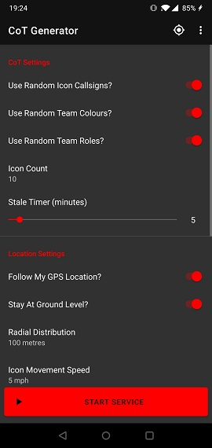
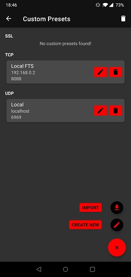
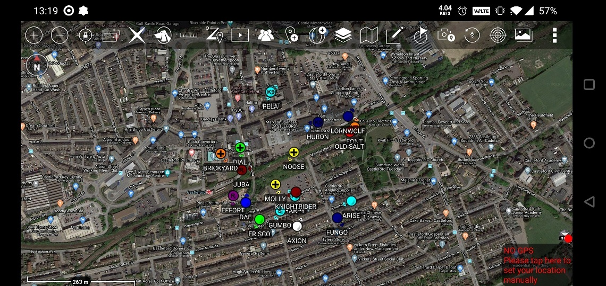
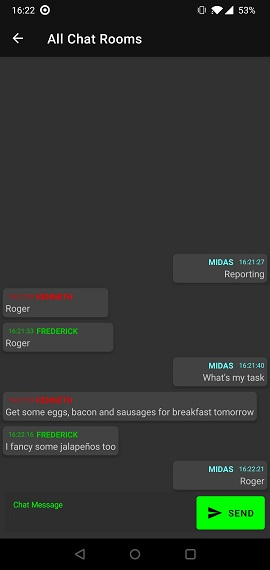

# Cursor On Target Generator

## Summary
This repo contains the code for two separate but very similar Android apps for generating Cursor On Target (CoT) data:
* **CoT Generator** - Generates an arbitrary number of moving CoT tracks in a circular area around a given point. Intended as a network stress-tester or demonstration tool.
* **CoT Beacon** - Generates a single CoT track to represent the phone's GPS position. Intended as a method of one-way situational awareness.

CoT Beacon was originally spun off as [a separate repository](https://github.com/jonapoul/cotbeacon), but has since been merged back in to make parallel development easier.

## Quick Start
1. Download the installer APK from [the GitHub releases page](https://github.com/jonapoul/cotgenerator/releases), then copy the file to your device and open it in a file browser to install.
2. Open the app and grant permissions for GPS access and reading external storage. See [permissions section](#permissions).
3. Configure as required. See [settings section](#settings).
4. Tap the green "START SERVICE" button at the bottom of the main screen. This begins the configured packet transmissions.
5. When finished, tap the blue "STOP SERVICE" bottom at the bottom, or the "STOP" button on the service notification.

## Screenshots

| Generator Main Screen | Beacon Main Screen
|:--:|:--:|
 |  |

| Custom Output Presets | Location Info
|:--:|:--:|
 |  |

| 20 Icons |
:--:|
|

| 20 Icons, elevated 500m |
:--:|
|

| The end times are nigh... |
:--:|
|

## Function

CoT Generator creates a specified number of representative CoT PLI tracks around a configured latitude/longitude point. These tracks are randomly scattered within the configured "Radial Distribution" and are given randomised ATAK callsigns (by default). After each transmission, each track is shifted slightly to a random nearby position dependent on the configured icon movement speed. Generator is mostly intended for network/server stress testing, but could also be useful for demonstration purposes.

Both apps support SSL, TCP and UDP traffic, and will give you notifications of any runtime connection errors (timeout, socket closing, etc.). Similarly, if you're travelling between different networks whilst the server is running (e.g. losing Wi-Fi signal then regaining it), you should expect it to stop running when the connection is lost. Just restart the service and it should work again.

Also included is a handy "My Location" screen - accessed from the toolbar on the home screen - which shows your current GPS position, compass orientation and some other useful values.

## Chat

As of version 1.7.0, a chat function has been added to allow text communication between CoT Beacon and anyone else on the TAK network. This supports UDP, TCP and SSL protocols, but only sends/receives messages through the "All Chat Rooms" group in TAK. A screenshot of the window is shown below. Note that these messages are not saved between app restarts, and messages can only be sent/received when the service is running.

| Beacon Chat |
:--:|
|

## Presets
The app is based around the idea of "output presets", which are connection configurations that specify a protocol, alias, address and port to which the app will send your generated data. These are stored in a database on the device for future use in case you swap between multiple servers.

At the moment (Oct 2020) these databases are independent between Beacon and Generator, so any preset configured in Beacon is not auto-imported into Generator. This shared data pool is something that I am looking to fix at some point in the future.

### Importing Presets
When adding a new preset, the user can either enter one manually (faffing about with the keyboard) or import one semi-automatically from an ATAK preference file or data package. To do this:
- Open the "Custom Presets" screen [as shown above](#screenshots)
- Tap the + button in the bottom right
- Tap "Import From File"
- Navigate to the location of your file.
    - If preferences are exported from ATAK's setting menu, look under /atak/config/prefs
    - If importing from a data package, look under /atak/tools/datapackage
- If the selected file contains multiple outputs, you will be presented with a list dialog asking to import one of them. Currently, only a single import can currently be performed at a time.
- When selected, the "Edit Preset" screen is shown, so you can edit to your heart's content. When done, tap the "save" button in the top right to finalise the process.

## Settings

Note that some of the following settings are not available on CoT Beacon.

| Option | Possible Values | Description |
|--------|-----------------|-------------|
| Use Random Callsigns? | True/False | When enabled, icon callsigns will be pulled at random from ATAK's default callsign list. |
| Callsign | Any characters except '<' or '>' | Acts as a base callsign for all generated icons. E.g. "GENERATED-1", "GENERATED-2", etc. |
| Use Indexed Callsigns? | True/False | When enabled, icons will have their callsigns appended with an identifying index, e.g. 'GENERATED-1'.z |
| Use Random Team Colours? | True/False |When enabled, icon colours are pulled at random from ATAK's team colour list. |
| Team Colour | Standard ATAK team colours | Colour to be applied to all icons. |
| Use Random Team Roles? | True/False | When enabled, icon roles are pulled at random from ATAK's role list. |
| Team Role | Standard ATAK icon roles | Role to be applied to all icons. |
| Icon Count | Positive integer | Number of icons to place on the map. |
| Stale Timer | 1 to 60 | Time (in minutes) after which icons will stale out of the TAK map. |
| Follow My GPS Location? | True/False | When enabled, all generated icons will follow your moving GPS position on the ATAK map. |
| Centre Latitude/Longitude | 
0 < longitude < 360 -90 < latitude < 90
 | Specifies the static centrepoint of all generated icons. |
| Stay At Ground Level? | True/False | When enabled, all icons are placed at an altitude of 0m HAE (height above ellipsoid). |
| Centre Altitude | 0 to 5km | Sets the vertical centrepoint of all generated icons. Icons will be distributed in a pseudo-cylinder around the specified lat/lon/HAE coordinates. |
| Radial Distribution | Positive integer | The radius of the icon distribution circle. Essentially a maximum distance each icon can possibly move from the centrepoint in 3D space. |
| Icon Movement Speed  | Positive integer | Speed at which each icon moves from point to point between each update. Note that the directional bearing is random. |
| Transmission Period | 1 to 30 | Update period for each icon. So if we have Icon Count of 40 and a Transmission period of 10 seconds, we'll send out 4 packets per second. |
| Transmission Protocol | SSL, TCP, UDP | Network protocol to use when sending out packets. |
| Data Format | XML or Protobuf | The serialisation format of the CoT packet. Note that TAK Servers over TCP/SSL only allow XML, so the option will be hidden for these protocols. |
| Output Destination | Any default or custom preset | The preconfigured destination for your generated packets. |

## Permissions
Two permissions requested:
- **GPS**: Only used for the "Follow My GPS Position" option, with which each generated icon will follow your GPS location as you move around.
- **Storage**: Only used to read client certificates and trust stores when configuring custom SSL presets.

## Security
Note that any SSL certificates/passwords loaded into the app are stored in a database in the application's private directory, and the password is in plaintext. Don't expect this to be super high-security!

## Troubleshooting
Note that 100% of testing has been done on a OnePlus 6 running Android 10. If there are any compatibility issues or crashes (I'm sure there are), please raise an issue!

## Acknowledgements
Thanks to the crew at the TAK Discord, most notably [Corvo](https://github.com/brothercorvo) and [Field Mapper](https://github.com/fieldmapper) for hosting their public [FreeTAKServer](https://github.com/FreeTAKTeam/FreeTakServer) and OG TAK Server respectively, used extensively for testing.

## TODO
- Add a button for sending/canceling
- Change app launcher icons
- Add a toggleable option to encrypt the database of presets
    - This would make SSL certificate passwords more secure, since they're currently stored in plaintext
    - www.outline.com/rnpyG6
- Deal with connection changes more securely
    - e.g. losing WiFi and moving to 4G, we still want to keep sending Beacon packets
- Add the option to post REST API messages to FTS instances
    - Would require me to identify whether a given server is an FTS
    - As an alternative to XML/Protobuf
- Dump error stack traces to a log file
    - Would help error identification
